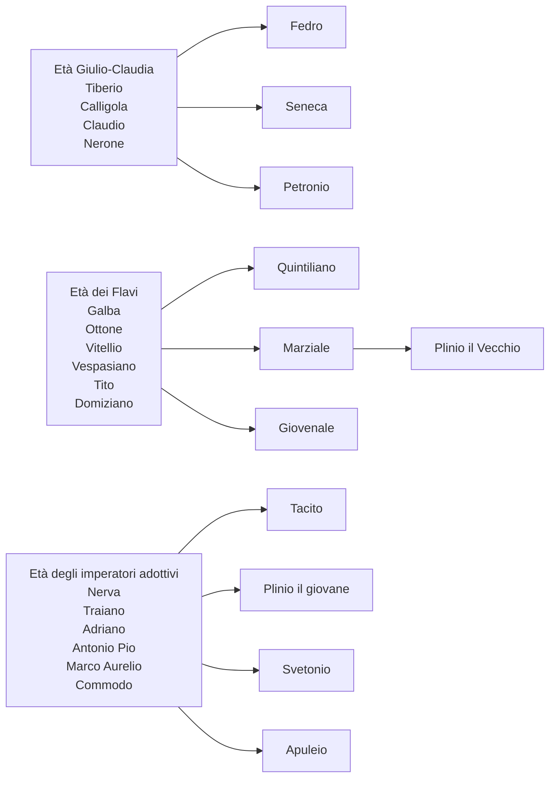

Subito dopo Augusto, l'impero diviene governato dalle dinastie. La prima dinastia è quella Giulio-Claudia^[Al quale faceva parte anche Giulio Cesare], di Augusto.

Il primo imperatore^[O meglio principato, per volontà di Augusto] è **Tiberio**. Questo era un uomo abbastanza anziano e navigato. Il suo governo dura molto tempo e la sua politica è molto moderata^[Quindi cerca di evitare opposizioni con il Senato], a differenza dei suoi successori. Si focalizza molto sul rendere più solido il tessuto economico del territorio. Ad un certo punto, perché paranoico e preoccupato che tramassero contro di lui, affida a *Seiano* il prefetto del pretorio e si ritira a Capri, governando "da lontano". Però la fiducia in Seiano era malriposta, perché questo era ambizioso e voleva sostituire Tiberio.

Dopo Tiberio viene **Caligola**. La candidatura fu portata avanti dalla milizia. Si ingraziò il popolo abbassando le tasse, ma la il suo governo divenne presto di stampo orientale, con una **monarchia assoluta** che prevedeva il culto assoluto dell'imperatore. Lo sperpero del patrimonio statale, le repressioni ed il generale malcontento porto al suo omicidio nel 41.

Dopo Caligola viene **Claudio**, nipote di Tiberio. Anche lui era piuttosto anziano. Si occupò di riorganizzare lo stato e non si fida di nessuno dopo aver visto cosa venne prima di lui. Formò la sua burocrazia personale, piena di persone competenti ed efficienti, senza tener conto del background culturale, anche perché diffidava dai nobili che puntavano ad uccidere gli imperatori. Venne ucciso dalla moglie per far salire al trono suo figlio Nerone. Figlio che era troppo giovane al tempo per governare, così la madre governò assieme a **Seneca**, filosofo intellettuale che formò Nerone. Questo fu un periodo positivo perché la distribuzione del potere fu molto equilibrata.

**Nerone** però, una volta diventato effettivamente imperatore, sentendosi sfruttato dalla madre, la fa uccidere e fa suicidare^[Obbliga al suicidio] Seneca. Generò un clima di terrore, il governo non fu equilibrato ed era anche un po' pazzo. Infatti segna la fine della dinastia con **l'incendio di Roma**, evento della quale Nerone, probabilmente, non fu responsabile, ma fu accusato perché fece costruire una villa sul luogo dell'incendio. Durante la sua epoca ci fu molta censura, infatti qui gli autori sperimenteranno molto. Addirittura viene importato e rielaborato dalla Grecia il **romanzo**.

## La lingua
In quest'epoca la lingua latina si apre anche a quella parlata. La letteratura non si esprime più in un linguaggio alto e aulico comprensibile solo ai pochi, ma si avvicina di più alla lingua parlata^[Soprattutto nel romanzo, considerato genere molto libero].
